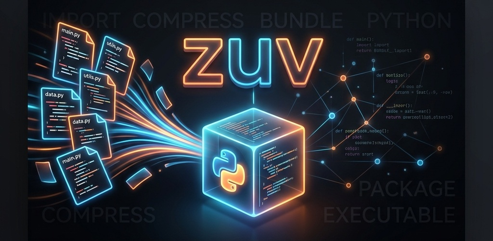

# zuv

**zuv packs your entire uv project into a single `.py` file** so you can hand it to a friend, drop it on a server, or attach it to an email and it just runs. The recipient only needs [uv](https://astral.sh/uv) installed — no Python install, no `pip install -r`, no virtualenv setup, no folder structure to preserve.

```sh
uv run my-app.py
```

One file. One command. Same behaviour on any machine.

## Why

Shipping a Python project usually means a zip, a README about setting up a venv, a `requirements.txt`, and a prayer that the recipient has the right Python version. zuv collapses all of that into one `.py` file that:

- Carries the **whole project** inside it (your `src/`, `pyproject.toml`, `uv.lock`, configs, assets — everything you don't `.gitignore`).
- On first run, extracts itself into `.zuv/<name>_<hash>/` next to the script, lets uv build a `.venv` inside that folder, then runs your entry point.
- On every later run, skips the extraction and just executes.
- Stays tiny (under ~10 KB even for a FastAPI app) because dependencies are installed at runtime by uv from PyPI, not embedded.

## Install

```sh
uv tool install zuv
```

## Project layout

Any standard uv project works. The most common shape:

```
my-project/
  pyproject.toml          # [project] dependencies = [...]
  src/
    main.py               # an executable script (with if __name__ == "__main__")
```

`main.py` at the project root also works.

## Build

From inside the project:

```sh
zuv build
# -> ./dist/<project-name>.py
```

Or point at a project explicitly:

```sh
zuv build ./my-project -o ./dist/my-app.py -e src/main.py
```

`zuv build` writes a fresh single-file script to the output path (use `--clean` to wipe the output's parent directory first). The entry point is resolved in this order:

By default, `zuv build` pre-compiles every `.py` to a sourceless `.pyc` (including the entry — Python and `uv run` both execute `.pyc` directly) and ships only bytecode. This ties the build to the builder's Python minor version because of marshal-format coupling. Pass `--no-compile` to keep `.py` sources instead; the loader will compile them at first extract, and the bundle stays portable across compatible Python versions.

1. `--entry`/`-e` flag
2. `[tool.zuv].entry` in `pyproject.toml`
3. `src/main.py` if it exists, otherwise `main.py`

## Run

```sh
uv run dist/my-app.py
# or, equivalently, via zuv:
zuv run dist/my-app.py -- --any --args --you --like
```

The shebang + PEP 723 header makes `uv run` the canonical entrypoint; `zuv run` is a thin wrapper for users who don't want to remember which tool to invoke. First run: uv extracts the bundle, creates `dist/.zuv/<name>_<hash>/.venv`, installs deps, runs your entry. Subsequent runs go straight to executing.

## Try the included examples

```sh
zuv build examples/bigtest -o dist/bigtest.py
uv run dist/bigtest.py

zuv build examples/fastapi -o dist/fastapi.py
uv run dist/fastapi.py
```

## Sibling overrides

The bundle's entry script runs with the extracted project folder as its CWD, so anything you would normally find next to your code (config files, frontend bundles, .env files) still works the same way.

## Inspect a built file

```sh
zuv inspect dist/my-app.py
```

Prints the entry, build hash, SHA-256, Python cache tag, PEP 723 metadata, and a summary of the embedded loader bytecode. The payload itself is elided so the output stays useful for LLMs and code review.

## Clear caches

```sh
zuv clean              # walk cwd, remove every .zuv/ found
zuv clean dist/        # or scope to a directory
zuv clean dist/app.py  # or to a built file (its parent is used)
```

The runtime also honors `$ZUV_CACHE_DIR` (and `$ZUV_MAX_EXTRACT_BYTES` for the decompression-bomb cap, default 2 GiB). If the script's directory isn't writable (system bin, read-only mount), the loader automatically falls back to `$XDG_CACHE_HOME/zuv`, `%LOCALAPPDATA%\zuv`, or `~/.cache/zuv`.

## A small caveat

Don't name your project the same as one of its dependencies. For example, a project named `fastapi` that depends on `fastapi` will confuse uv during install. Rename it to `fastapi-example` (or similar) and you're fine.

## How it works

The output `.py` has five parts:

1. A `#!/usr/bin/env -S uv run --script` shebang and a PEP 723 metadata block declaring `requires-python` (no deps — uv reads those from the embedded `pyproject.toml` after extraction).
2. Metadata globals: `_ZUV_ENTRY`, `_ZUV_BUILD_ID`, `_ZUV_SHA` (sha256 of decoded payload), `_ZUV_PY_TAG` (build-time Python cache tag).
3. `_ZUV_PAYLOAD` — a deterministic `tar.xz` of your project tree, base85-encoded (uv's script runner requires UTF-8 source, which rules out raw-binary appends).
4. `_ZUV_LOADER` — the runtime loader, `compile()`d to bytecode then `marshal`+`zlib`+base85 (opaque to casual readers; verify with `zuv inspect`).
5. A 3-line stub that `exec`s the loader, which then verifies the payload sha, extracts into `.zuv/<stem>_<hash>/` with a `.zuv-ready` sentinel, and runs `uv run --project <extracted> <entry>`.

Dependencies aren't bundled inside the `.py`. uv installs them into the extracted project's local `.venv` on first run, so binary wheels work natively and the bundle stays small.

## Layout

```
src/
  pyproject.toml
  zuv/
    cli.py                 # zuv CLI (build, inspect)
    builder.py             # tarball + base85 + compile loader + emit .py
    inspector.py           # zuv inspect
    _loader_template.py    # runtime loader embedded in every output
    constants.py
examples/
  bigtest/                 # rich + pydantic smoke test
  fastapi/                 # FastAPI + uvicorn web app
```
